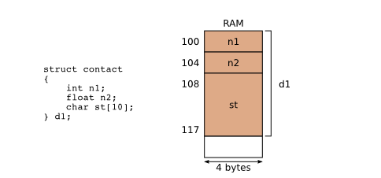
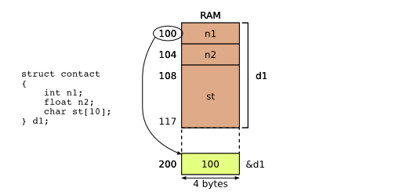
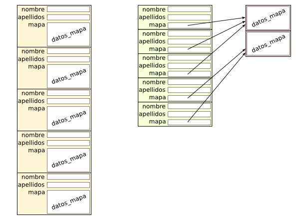

# Punteros

Los punteros en C son variables que almacenan direcciones de memoria en lugar de valores directos. Esto permite acceder y manipular datos almacenados en esas direcciones de manera eficiente. 

- **Todo dato está almacenado a partir de una dirección de memoria. Esta dirección puede ser obtenida y manipulada también como un dato más.**

## a) Todo dato tiene una dirección de memoria

Todos los datos se almacenan a partir de una dirección de memoria y utilizando tantos bytes como sea necesario. 

Asumiendo que int y float ocupan 4 bytes cada uno, y char ocupa 1 byte, si d1 (dato tipo struct) está almacenada a partir de la posición 100, entonces su campo n1 tiene esa misma dirección, el campo n2 está en la posición 104 y el campo st está almacenado a partir de la posición 108.

## b) Indirección 

Supongamos que las direcciones de memoria se representan internamente con 32 bits (4 bytes). Entonces, podemos almacenar la dirección de d1 (el número 100) en otro lugar en memoria que ocupará 4 bytes por ser una dirección de memoria. 

Obtner la dirección de memoria de una variable

>&variable

Ejemplo, tomando en cuenta la imagen anterior, la expresión &d1 devuelve el valor de 100.

- Otra forma de mostrarlo sería que en la posición de memoria 200 hay un puntero a d1.

- Si en la posición 200 está almacenado un puntero a la variable d1 se pueden acceder a los datos de esta estructura mediante una “indirección”. 
Se toma el dato almacenado en la posición 200 y su valor (el número 100) se interpreta ahora como una dirección. Se accede a esa dirección y de ahí se accede a los campos de d1. Acabamos de acceder a d1 de forma indirecta, o a través de una “indirección”

## c) Tipo de datos "puntero a"

> nombre_variable *; // puntero a nombre_variable

El operador & seguido del nombre de una variable devuelve su dirección de memoria.

**El tamaño de los punteros es siempre el mismo independientemente del dato al que apuntan porque todos ellos almacenan una dirección de memoria.**

El tamaño de los punteros es **siempre el mismo independientemente del dato al que apuntan** porque todos ellos almacenan una dirección de memoria.

>struct contact contact1;

>struct contact *contactPointer;

La variable **contact1** es de tipo estructura y ocupa 44 bytes (20 + 20 + 4), mientras que **contactPointer** es de tipo puntero y ocupa 4 bytes.

## d) Asignación de una dirección de memoria  a puntero

~~~ C
include <stdio.h>
int main() 
{
    // Declaración de variables tipos enteros
    int num1, num2;
    
    // Declararción de variables tipo puntero a entero
    int *ptr1, *ptr2;

    num1 = 10;
    num2 = 20;

    // Guarda la dirección de memoria en el puntero
    ptr1 = &num1;
    ptr2 = &num2;

    ptr1 = ptr2;
    ptr2 = NULL;

    return 0;
} 
~~~

## e) Indirección através de punteros

Los punteros tienen dos cometidos:
- Almacenar una dirección de memoria. 
- Utilizar la dirección de memoria almacenada para acceder al dato al que apunta mediante una indirección.

En C la indirección se denota con el operador *  seguido del nombre de una variable de tipo puntero (**accede al contenido al que apunta el puntero**).

~~~C
#include <stdio.h>
int main(int argc, char** argv) 
{
    int num1, num2;
    int *ptr1, *ptr2;

    ptr1 = &num1;
    ptr2 = &num2;

    num1 = 10;
    num2 = 20;

    // Asigna el valor de 30 a la dirección de memoria almacenada en ptr1
    // En otras palabras cambiar el valor de num1 usando ptr1
    *ptr1 = 30;
    *ptr2 = 40;

    // Pasa el contenido actual del puntero ptr1 a ptr2
    *ptr2 = *ptr1;

    return 0;
}
~~~

### e.1) Acceso indirecto a los campos de una estructura

~~~C
struct s 
{
    int x;
    char c;
}

struct s element;

struct s *pointer;
pointer = &element;

// Cuando se realiza una indirección con pointer es sólo para acceder a 
// los campos de la estructura. Esta operación requiere dos operadores, 
// la indirección (operador “*” y el acceso a los campos de una estructura (operador “.”).

(*pointer).x = 10;
(*pointer).c = 'l';

// Estas dos operaciones en C se agrupan en el operador “->” 

pointer->x = 10;
pointer->c = 'l';
~~~

## f) Puntero a punteros

~~~C
#include <stdio.h>
int main() 
{
    int i;
    int *ptrToi;           /* Puntero a entero */
    int **ptrToPtrToi;     /* Puntero a puntero a entero */

    ptrToPtrToi = &ptrToi; /* Puntero contiene dirección de puntero */
    ptrToi = &i;           /* Puntero contiene dirección de entero */

    i = 10;                /* Asignación directa */
    *ptrToi = 20;          /* Asignación indirecta */
    **ptrToPtrToi = 30;    /* Asignación con doble indirección */

    return 0;
}
~~~

## g) Uso de la indirección

El uso de punteros en C sólo se justifica si ofrecen una clara ventaja frente a la manipulación de datos directamente.

### g.1) Parámetros por referencia

Hay situaciones en que nos interesará crear funciones que modifiquen el valor de la variable que se le pasa como parámetro y que esta modificación retorne a la función llamadora. 

~~~C
	
 #include <stdio.h>
     
      /* Definición de función "swap". Fíjate que las variables se reciben como puntero a esas variables. */
     void sswap ( int *x, int *y )
      {
          /*Declaramos una variable temporal*/
          int tmp;
          tmp = *x;
          *x = *y;
          *y = tmp;
      }
      
      int main() 
      {
            int a, b;
            a = 1;
            b = 2;

            /*Llamamos a la función "swap" pasándole la dirección a las variables a y b.*/
            swap( &a, &b );
            /*Imprime los valores de a y b intercambiados*/
            printf(" a = %d b = %d\n", a, b );

      }
~~~

### g.2) Estructuras como parámetros

~~~C
#include <stdio.h>
#include <math.h>
/* Definición de la estructura */
struct coordenadas 
{
    float x;
    float y;
    float z;
};

/* Definición de función que calcula la distancia entre dos puntos */
float distancia(struct coordenadas a, struct coordenadas b) 
{
    return sqrtf(pow(a.x - b.x, 2.0) + 
                 pow(a.y - b.y, 2.0) + 
                 pow(a.z - b.z, 2.0));
}

int main() 
{
    /* Declaración e inicialización de dos variables */
    struct coordenadas punto_a = { 3.5e-120, 2.5, 1.5 };
    struct coordenadas punto_b = { 5.3e-120, 3.1, 6.3 };
    float d; /* Almacenar el resultado */

    /* Llamada a la función con las dos estructuras */    
    d = distancia(punto_a, punto_b);
    /* Imprimir el resultado */
    printf("%f\n", d);

    return 0;
}
~~~

En la línea 26 se realiza una copia de las estructuras punto_a y punto_b en el ámbito de la función main a las estructuras a y b en el ámbito de la función distancia. 

Esta copia tiene dos efectos: el programa invierte tanto tiempo como datos haya en la estructura, y durante la ejecución de la función se mantienen en memoria dos copias completas de las estructuras. El uso de punteros ofrece una alternativa más eficiente. 

**La función (código anterior) puede reescribirse para que reciba dos punteros a las estructuras.** La definición de la función pasa a ser:

~~~C
#include <stdio.h>
#include <math.h>
/* Definición de la estructura */
struct coordenadas 
{
    float x;
    float y;
    float z;
};

/* Definición de función que calcula la distancia entre dos puntos */
float distancia(struct coordenadas *a_ptr, struct coordenadas *b_ptr) 
{
    return sqrtf(pow(a_ptr->x - b_ptr->x, 2.0) + 
                 pow(a_ptr->y - b_ptr->y, 2.0) + 
                 pow(a_ptr->z - b_ptr->z, 2.0));
}

int main() 
{
    /* Declaración e inicialización de dos variables */
    struct coordenadas punto_a = { 3.5e-120, 2.5, 1.5 };
    struct coordenadas punto_b = { 5.3e-120, 3.1, 6.3 };
    float d; /* Almacenar el resultado */

    /* Llamada a la función con las dos estructuras */    
    d = distancia(&punto_a, &punto_b);
    /* Imprimir el resultado */
    printf("%f\n", d);

    return 0;
}
~~~
**Con esta nueva versión, el programa ejecuta exactamente los mismos cálculos, obtiene el mismo resultado, pero su ejecución es más rápida, y utiliza menos memoria.**

Para compilar se necesitaría agregar un comando mas al comando de compilación. Esto debido al uso de la biblioteca de matemática.

> gcc -Wall -o programa fichero.c -lm

### g.3) Enlaces entre estructuras 

Otro escenario en el que los punteros son de gran utilidad es para “enlazar” estructuras de datos.

~~~C
	
#define SIZE 64
struct datos_mapa 
{
/* Datos referentes al mapa */
};

struct datos_contacto 
{
    char nombre[SIZE];
    char apellidos[SIZE];
    /* Datos del mapa para este contacto */
    struct datos_mapa *mapa;
};
~~~

## i) Punteros a funciones

Un puntero a función es una variable que almacena la dirección de una función. Esta función puede ser llamada más tarde, a través del puntero.
Este tipo de construcción es útil pues encapsula comportamiento, que puede ser llamado a través de un puntero. 

~~~C
#include <stdio.h>
void imprime()
{ 
  printf("Imprimiendo un message\n"); 
}
int  main()
{
  void (*ptr_funct)(void)=imprime;
  ptr_funct(); //Llama a imprime
  return 0;
 }
~~~

Los punteros a funciones también se usan para realizar funciones de retrollamada (callback, en inglés).

~~~C
 #include <stdio.h>      
void imprimiendo_hola(int x)
{
    printf( "[*HOLA__] Hola número %d\n", x);
}

 void imprimiendo_adios(int x, void (*ptr_func)())
{
    printf( "[*ADIOS_] Adios número %d\n", x);
    if(ptr_func!=NULL)
    {
      ptr_func();  //Usando el puntero para retrollamar
    }
}

void func_call_back()
{
    printf( "[*RETRO_] Retrollamada llamada\n");
}

int main()
{   // Definimos dos punteros a funciones
    void (*ptr_func_1)(int)=NULL;
    void (*ptr_func_2)(int, void (*call_back_func)() )=NULL;    
    //Usamos el primero
    ptr_func_1 = imprimiendo_hola;
    printf("[*MAIN__] La dirección del primer puntero is %p\n",ptr_func_1);
    ptr_func_1(3); 
    //Usamos el segundo
    ptr_func_2 = imprimiendo_adios;    
    printf("[*MAIN__] Using a callback función \n",ptr_func_2);    
    ptr_func_2(3,func_call_back);     
    return 0;
}
~~~

# Bibliografía 

- https://www.it.uc3m.es/pbasanta/asng/course_notes/pointers_es.html
