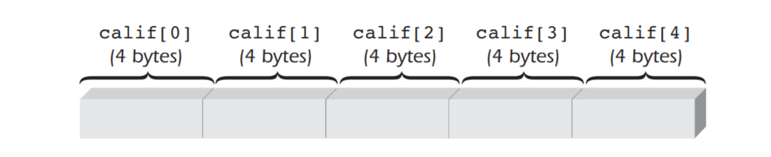
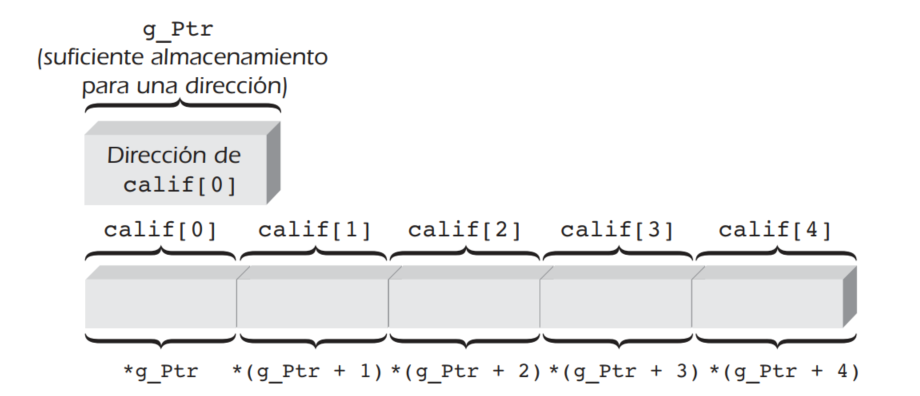
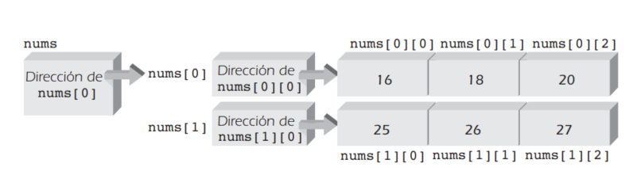

# Punteros en C++

Los punteros en C++ son una herramienta que sirveb para trabajar con memoria de forma eficiente. Permiten **almacenar la dirección de memoria** de una variable, lo que **permite el acceso directo a su contenido** y permite además realizar operaciones avanzadas de gestión de memoria.

Sintáxis

> tipo_de_datos *nombre_puntero

## A) Direciones y apuntadores

Para desplegar la dirección de una variable se puede usar el operador de dirección de C++, **&**.

### 1. Declaración - Almacenamiento de direcciones

Se debe declarar el puntero según el tipo de datos al que se quiere apuntar 

~~~cpp
    int dir;
    // puntero guarda la direccón de la varirable dir
    int* ptr = &dir;
~~~

### 2. Operaciones con punteros

- **Acceso al contenido de una variable:** Se utiliza el operador *.

- **Modificación del contenido de una variable:** Se utiliza el operador *.

- **Obtención de la dirección de memoria de una variable:** Se utiliza el operador &.

- **Aritmética de punteros:** Se pueden sumar y restar punteros para navegar por la memoria.

**`Nota:`** EL simbolo `*` se le conoce como operador de indirección

~~~cpp
    int dir = 0;
    // puntero guarda la direccón de la varirable dir
    int* ptr = &dir;

    *ptr = 10; // Accede al contenido de dir a través del puntero y lo cambia por 10
~~~

### 3. Referencias y apuntadores

Una referencia es una constante nombrada para una dirección; como tal, la dirección nombrada como una referencia no puede ser alterada.

Desde el punto de vista técnico, se dice que las referencias se desreferencian automáticamente o se desreferencian implícitamente (los dos términos se usan como sinónimos), mientras los apuntadores deben desreferenciarse de manera explícita para localizar el valor al que tienen acceso.

### 4. Variables de referencia

Las referencias se usan de manera casi exclusiva como parámetros formales de función y como tipos a devolver. No obstante, las variables de referencia también están disponibles en C++. 

Una vez que se ha establecido otro nombre para una variable usando una declaración de referencia, el nuevo nombre, el cual se conoce como un alias, puede usarse en lugar del
nombre original. 

~~~cpp
    double& suma = total;
    suma = 20.5
    total = 18.6

    /*
        Dado que la variable suma tan sólo es otra referencia a la variable total cambiar el valor en suma cambia entonces el valor en total
    */
~~~

~~~cpp
int main() {
    double total = 20.5 // declara e inicializa total
    double& suma = total; // declara otro nombre para total

    cout << “suma = ” << suma << endl;
    suma = 18.6; // esto cambia el valor en total
    cout << “total = ” << total << endl;

    return 0;
}
~~~

**La ventaja de usar la referencia** es que ejecuta de manera automática un acceso indirecto al valor de b sin la necesidad de usar de forma explícita el símbolo de indirección, *. Como se ha señalado antes, este tipo de acceso se conoce como desreferencia automática.

~~~cpp
    int b;      // b es una variable en número entero
    int& a = b; // a es una variable de referencia que almacena la
    direccion de b
    a = 10;     // esto cambia el valor de b a 10
~~~

Para implementar esta misma correspondencia entre a y b usando apuntadores se hace con la siguiente secuencia de instrucciones:

~~~cpp
    int b;       // b es una variable en número entero
    int *a = &b; // a es un apuntador, almacena la direccion
    de b en a
    *a = 10;     // esto cambia el valor de b a 10 al             desreferenciarlo de manera explícita de la direccion en a
~~~

## B) Nombres de arreglos como apuntadores 

Aunque los apuntadores son, por definición, tan sólo variables usadas para almacenar direcciones, también **existe una relación directa y estrecha entre los nombres de los arreglos y los apuntadores**.

Usando subíndices, se hace referencia al cuarto elemento en el arreglo calif como calif[3]. El uso de un subíndice, sin embargo, oculta el uso extenso de direcciones por la computadora.

Llamar al cuarto elemento calif[3] obliga al compilador, en forma interna, a hacer el cálculo de dirección:

> &calif[3] = &calif[0] + (3 * sizeof(int))

Esta instrucción se lee: La dirección de calif[3] es igual a la dirección de calif[0] más 12.

Por ejemplo, si se almacena la dirección de calif[0] en un apuntador llamado g_Ptr (usando la instrucción de asignación g_Ptr = &calif[0];), entonces, como se ilustra en la figura 12.11, la expresión *g_Ptr, la cual significa “la variable a la que apunta g_Ptr”, hace referencia a calif[0].

> int calif[5] = {98, 87, 92, 79, 85};

> int *g_Ptr = &calif[0];

Por tanto, existe equivalencia en lo siguiente:

> calif[i] = *(calif + i);

Una característica única de los apuntadores es que pueden **incluirse desplazamientos** en las expresiones que usan apuntadores. Por ejemplo, el 1 en la expresión *(g_Ptr + 1) es un desplazamiento. La expresión completa hace referencia al número entero que está un lugar adelante de la variable a la que apunta g_Ptr. Del mismo modo, como se ilustra en la figura 12.12, la expresión *(g_Ptr + 3) hace referencia a la variable que está tres números enteros adelante de la variable a la que apunta g_Ptr. Ésta es la variable calif[3]

 

 

Cuando se crea un arreglo, el compilador crea de manera automática una constante apuntadora interna para éste y almacena la dirección inicial del arreglo en este apuntador.

### 1. Asignación dinámica de arreglos

Conforme se define cada variable en un programa se le asigna suficiente almacenamiento de una reserva de ubicaciones de memoria en la computadora que se ponen a disposición del compilador.

La asignación dinámica de memoria es útil en extremo cuando se manejan listas, debido a que permite que se expanda la lista conforme se agregan nuevos elementos y se contraiga conforme se eliminan.

`Nota:` **Los operadores new y delete (requieren el archivo de encabezado new)**

> #include <new>

| Nombre del operador | Descripción                                                                                                                                      |
|---------------------|--------------------------------------------------------------------------------------------------------------------------------------------------|
| new                 | Reserva el número de bytes solicitado por la declaración. Devuelve la dirección de la primera ubicación reservada o NULL si no se dispone de suficiente memoria. |
| delete              | Libera un bloque de bytes reservado con anterioridad. La dirección de la primera ubicación reservada debe transmitirse como un argumento al operador.         |

La siguiente instruccipon reserva un área suficiente para almacenar 200 números enteros y coloca la dirección del primer número entero en el apuntador calif

> int *calif = new int[200];

Dado que los nombres del apuntador y del arreglo están relacionados, puede tenerse acceso a cada valor en el área de almacenamiento recién creada usando una notación de arreglo estándar, como calif[i], en lugar de la notación de apuntador equivalente *(calif + i).

Después de asignar memoria dinámica, en este caso para el vector calif[], se debe usar el operador delete[], para devolver esa memoria al computador.

> delete[] calif;

## C) Aritmética de apuntadores

El valor almacenado en un apuntador es, por supuesto, una dirección. Por tanto, al sumar y restar números a los apuntadores se pueden obtener direcciones diferentes.

Las direcciones en los apuntadores pueden compararse usando cualquiera de los operadores relacionales ( ==, !=, < , >, etc.)

Considerar las siguientes declaraciones:
> int nums[100];

> int *npt;

Para establecer la dirección de nums[0] en nPt se puede usar cualquiera de las siguientes dos instrucciones de asignación:

> nPt = &nums[0];

> nPt = nums;

Una vez que nPt contiene una dirección válida, pueden sumarse y restarse valores de la dirección para producir direcciones nuevas.

Los **operadores de incremento y decremento** pueden aplicarse como operadores de apuntador de prefijo o posfijo. Todas las siguientes combinaciones que usan apuntadores son válidas:

- *ptNum++ // usa el apuntador y luego lo incrementa 
- *++ptNum // incrementa el apuntador antes de usarlo 
- *ptNum-- // usa el apuntador y luego lo decrementa 
- *--ptNum // decrementa el apuntador antes de usarlo

~~~cpp
#include <iostream>
using namespace std;
int main() {
    
    const int NUMS = 5;
    int nums[NUMS] = {16, 54, 7, 43, -5};
    
    int i, total = 0, *nPt;
    nPt = nums; // almacena la dirección de nums[0] en nPt

    for (i = 0; i < NUMS; i++)
        total = total + *nPt++; // acumula los valores “a los que apunta” la variable apuntadora nPt
        cout << “El total de los elementos del arreglo es ” << total << endl;
    return 0;
}
~~~

## D) Transmisión de direcciones 

Para transmitir de manera explícita una dirección a una función todo lo que se necesita hacer es colocar el operador de dirección, &, enfrente de la variable que se está transmitiendo.

~~~cpp
intercambio(&primernum, &segundonum); // transmite las direcciones de las variables primernum y segundonum a intercambio()
~~~

Suponiendo que primernum y segundonum son variables de precisión doble, y que intercambio() no devuelve un valor, una línea de encabezado de función adecuada para intercambio es

~~~c++
void intercambio(double *dirNum1, double *dirNum2);
~~~

### 1. Transmisión de arreglos

Cuando se transmite un arreglo a una función, su dirección es el único elemento que se transmite en realidad.

~~~cpp
#include <iostream>
using namespace std;

int hallarMax(int [], int); // prototipo de la función

int main() {
    const int NUMPTS = 5;
    int nums[NUMPTS] = {2, 18, 1, 27, 16};
    cout << "\nEl valor máximo es " << hallarMax(nums,NUMPTS) << endl;
    return  0 ;
}
//  esta función devuelve el valor máximo en un arreglo de números enteros
int hallarMax(int vals[], int numels){
    int i, max = vals[0];
    for (i = 1; i < numels; i++)
        if  (max < vals[i])
            max = vals[i];
    return max;
}
~~~

En vista que la dirección transmitida a hallarMax() es la dirección de un número entero, otra línea de encabezado adecuada para hallarMax() es:

~~~cpp
int hallarMax(int *vals, int numels){ // encuentra el valor máximo
    int i, max = vals[0];
    for (i = 1; i < numels; i++)
        if (max < vals[i]) 
            max = vals[i];
    return max;
}
~~~

Sin tomar en cuenta cómo se declaró vals en el encabezado de la función o cómo se usa dentro del cuerpo de la función, en verdad es una variable apuntadora. Por tanto, la dirección en vals puede modificarse. Esto no sucede con el nombre nums. Dado que nums es el nombre del arreglo originalmente creado, es una constante apuntadora, esto significa que la dirección en nums no puede cambiarse y que no puede tomarse la dirección de nums en sí. Sin embargo, ninguna de estas restricciones se aplican a la variable apuntadora llamada vals. Toda la aritmética de direcciones que se aprendió en la sección anterior puede aplicarse de manera legítima a vals.

Por tanto se puede reescribir dos nuevas versiones para hallarMax();

- **Primera versión**
En la primera versión tan sólo se sustituye la notación de apuntador por **notación de subíndice**.

    > nombreArreglo[i] = *(nombreArreglo + i)

~~~cpp
int hallarMax(int *vals, int numels){ // halla el valor máximo
    int i, max = *vals;
    for (i = 1; i < numels; i++)
        if (max < *(vals + i) ) 
            max = *(vals + i);
    return max;
} 
~~~

- **Segunda versión**
En la segunda versión **se usará aritmética de direcciones** para cambiar la dirección en el apuntador. De este modo se aprovecha el hecho que puede cambiarse la dirección almacenada en vals. 
Después que se recupera cada elemento del arreglo usando la
dirección en vals, la dirección en sí se incrementa en uno en la lista que se altera en la instrucción for. La expresión max = *vals usada antes para establecer max con el valor de vals[0] es reemplazada por la expresión max = *vals++, la cual ajusta la dirección en vals para que apunte al segundo elemento en el arreglo.

~~~cpp
int hallarMax(int *vals, int numels){ // encuentra el valor máximo
    int i, max = *vals++; // obtiene el primer elemento y lo incrementa
    for(i=1;i<numels;i++,vals++)
        if(max<*vals)
            max=*vals;
    return max;
}
~~~

### 2. Notación avanzada para apuntadores

También puede tenerse acceso a arreglos multidimensionales usando notación de apuntador, aunque la notación se vuelve cada vez más críptica conforme aumentan las dimensiones del arreglo.

Se tiene la siguiente matriz:

> int nums[2][3] = { {16,18,20}, {25,26,27} };

Esta declaración crea un arreglo de elementos y un conjunto de constantes apuntadoras llamadas nums, nums[0] y nums[1]. 

 

Un arreglo bidimensional se puede considerar como un arreglo de filas, donde cada fila en sí misma es un arreglo de tres elementos. 
Considerado de este modo: 

- el primer elemento en la primera fila es proporcionada por nums[0] 

- la dirección del primer elemento en la segunda fila es proporcionada por nums[1]. 

- por tanto, la variable a la que apunta nums[0] es nums[0][0] y la variable a la que apunta nums[1] es nums[1][0]

Una vez que se entiende la naturaleza de estas constantes, puede tenerse acceso a cada elemento en el arreglo al aplicar un desplazamiento apropiado al apuntador apropiado. Por tanto, las siguientes notaciones son equivalentes:

| Notación de apuntador | Notación de subíndice | Valor |
|-----------------------|-----------------------|-------|
| `*nums[0]`            | `nums[0][0]`          | 16    |
| `*(nums[0] + 1)`      | `nums[0][1]`          | 18    |
| `*(nums[0] + 2)`      | `nums[0][2]`          | 20    |
| `*nums[1]`            | `nums[1][0]`          | 25    |
| `*(nums[1] + 1)`      | `nums[1][1]`          | 26    |
| `*(nums[1] + 2)`      | `nums[1][2]`          | 27    |

Ahora es posible avanzar más y reemplazar nums[0] y nums[1] con sus respectivas notaciones de apuntador, usando la dirección de la misma nums: 

- la variable a la que apunta nums es nums[0]. Es decir, *nums es nums[0].

- del mismo modo, *(nums + 1) es nums[1]. 

Usar estas relaciones conduce a las siguientes equivalencias:

| Notación de apuntador      | Notación de subíndice | Valor |
|----------------------------|-----------------------|-------|
| `*(*nums)`                 | `nums[0][0]`          | 16    |
| `*(*nums + 1)`             | `nums[0][1]`          | 18    |
| `*(*nums + 2)`             | `nums[0][2]`          | 20    |
| `*(*(nums + 1))`           | `nums[1][0]`          | 25    |
| `*(*(nums + 1) + 1)`       | `nums[1][1]`          | 26    |
| `*(*(nums + 1) + 2)`       | `nums[1][2]`          | 27    |

Se aplica la misma notación cuando se transmite un arreglo bidimensional a una función. 
Por ejemplo, supóngase que el arreglo bidimensional nums se transmite a la función calc() usando la llamada calc(nums); Aquí, como con todas las transmisiones de arreglos, se transmite una dirección. 

Una línea de encabezado de la función adecuada para la función calc() es:

> calc(int pt[2][3])

Como ya se ha visto, la declaración de parámetros para pt también puede ser 

> calc(int pt[][3])

Usando notación de apuntador, otra declaración adecuada es 

> calc(int (*pt)[3]) 

En esta última declaración **se requieren los paréntesis interiores** para crear un apuntador único para arreglos de tres números enteros. Por supuesto, cada arreglo es equivalente a una sola fila del arreglo nums. Al desplazar de manera adecuada el apuntador, puede tenerse acceso a cada elemento en el arreglo. Hay que observar que sin los paréntesis la declaración se vuelve

> int *pt[3]

**lo cual crea un arreglo de tres apuntadores**, cada uno apuntando a un solo número entero. Una vez que se hace la declaración correcta para pt (puede usarse cualquiera de las tres declaraciones válidas), todas las notaciones siguientes dentro de la función calc() son equivalentes:

| Notación de apuntador      | Notación de subíndice | Valor |
|----------------------------|-----------------------|-------|
| `*(*pt)`                   | `pt[0][0]`            | 16    |
| `*(*pt + 1)`               | `pt[0][1]`            | 18    |
| `*(*pt + 2)`               | `pt[0][2]`            | 20    |
| `*(*(pt + 1))`             | `pt[1][0]`            | 25    |
| `*(*(pt + 1) + 1)`         | `pt[1][1]`            | 26    |
| `*(*(pt + 1) + 2)`         | `pt[1][2]`            | 27    |

### 3. Punteros a funciones

También se puede declarar apuntadores que apunten a una función (que contengan la dirección de). Los apuntadores a funciones son posibles debido a que los nombres de función, como los nombres de arreglos, son en sí mismos constantes apuntadoras. 

Por ejemplo, la declaración 

> int (*calc)()

declara que calc() es un apuntador a una función que devuelve un número entero. Esto significa que calc contendrá la dirección de una función, y la función cuya dirección está en la variable calc devuelve un valor en número entero. Por ejemplo, si la función suma() devuelve un número entero, es válida la asignación calc = suma;.