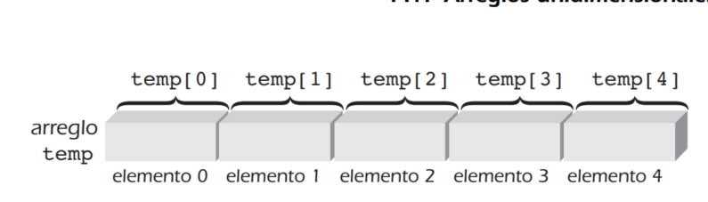
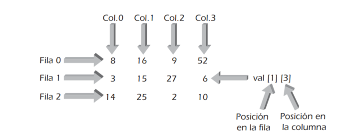

# Arreglos en C++

## A) Arreglos unidimensionales

Es una lista simple que contiene elementos individuales del mismo tipo de datos. 

### 1. Declaración

> int entero; // declara una variable de tipo entero

> tipo_de_datos nombre_arreglo[tamaño]; // declara un arreglo de tipo "tipo de datos (int, char, float)"

La buena práctica de programación requiere definir el número de elementos en el arreglo como una constante antes de declarar el arreglo.

> const int size_arreglo = 5;

> int arreglo[size_arreglo];

Cada elemento en un arreglo se llama **elemento** o **componente** del arreglo. Los elementos se almacenan de manera secuencial.

Se puede tenerse acceso a cualquier elemento individual dando el nombre del arreglo y la posición del elemento. Esta posición se llama valor índice o subíndice del elemento. Para un arreglo unidimensional, el primer elemento tiene un índice de 0, el segundo elemento tiene un índice de 1, etc. 

> const int temp_size = 5;

> int temp[temp_size];

### 2. Acceso a las posiciones del arreglo

Para acceder a cualquier elemento del arreglo, ejemplo acceder al elemento tres

> int valor_temp = temp[3];

## B) Inicialización de Arreglos 

### 1. Formas de inicializar arreglos

Los elementos del arreglo pueden inicializarse dentro de sus instrucciones de declaración de la misma manera como lo hacen las variables escalares, excepto que los elementos inicializados deben incluirse entre llaves. 

Ejemplos:

~~~cpp
int temp[5] = {25, 65, 89, 25, 21};
char code[5] = {'a', 'g', 'd', 'e', 't'};
    
// Debido a que el espacio en blanco es ignorado en C++, las inicializaciones 
// pueden continuarse a lo largo de múltiples líneas.

int galones[20] = {19,16,14,19,20,5
                   12,10,22,15,18,17,      
                   16,14,23,19,15,18,      
                   21,5};
~~~

**Si el número de inicializadores es menor que el número de elementos declarado enlistados entre corchetes**, los inicializadores se aplican empezando con el elemento 0 del arreglo. Por tanto, en la declaración:

> double largo[7] = {7.8, 6.4, 4.9, 11.2};

sólo se inicializan las posiciones 0, 1, 2 y 3 con los valores enlistados. Los otros elementos del arreglo (4, 5, 6) serán inicializados en cero.

### 2. Carcterísticas de los inicizalizadores en c++

Una característica única de los inicializadores es que **puede omitirse el tamaño de un arreglo** cuando los valores de inicialización están incluidos en la instrucción de declaración. Por ejemplo, la declaración

> int numeros[] = {16, 12, 10, 14, 11};

Otro ejemplo usando arreglos de caracteres:

> char codes[7] = {'m', 'u', 'e', 's', 't', 'r', 'a'};

> char codes[] = {'m', 'u', 'e', 's', 't', 'r', 'a'};

Recordar que una cadena es cualquier secuencia de caracteres encerrados entre comillas. 

> char codes[] = "muestra";

Esta última declaración crea un arreglo llamado codigos que **tiene ocho elementos** y llena el arreglo con los ocho, 7 declarados en comillas mas uno extra, que sería el salto de línea "\n" (también llamda caracter nulo).

## C) Arreglos Bidemensionales (Matrices/tablas)

### 1. Declaración

Para reservar almacenamiento para este tipo de arreglos, se debe incluir el **número de filas** y el **número de columnas** en la declaración del arreglo.

> char codes[7][10];

> int matriz[3][4];

### 2. Acceso a la matriz

Para localizar cada elemento en un arreglo bidimensional, un elemento se identifica por su posición en el arreglo. 

> valor = matriz[0][1];

> matriz[0][1] = 5;

### 3. Otras formas de inicializar matrices

Como con los arreglos unidimensionales, los arreglos bidimensionales pueden inicializarse desde dentro de sus instrucciones de declaración. 

~~~cpp
int matriz[3][4]={ {8,16,9,52},
                {3,15,27,6},
                {14,25,2,10} };
~~~

Aunque siempre se requieren las comas en las llaves de inicialización, las llaves internas pueden omitirse. 
Por tanto, la inicialización para matriz puede escribirse como

~~~cpp
int val[3][4] = {8,16,9,52,
                 3,15,27,6,
                 14,25,2,10};
~~~

La separación de los valores iniciales en filas en la instrucción de declaración no es necesaria en virtud que el compilador asigna valores comenzando con el elemento [0][0] y procede fila por fila para llenar los valores restantes. Por tanto, la inicialización

~~~cpp
int val[3][4] = {8,16,9,52,3,15,27,6,14,25,2,10};
~~~

es igual de válida pero no ilustra con claridad a otro programador dónde termina una fila y comienza otra.

### 4. Arreglos dimensionales mayores

Aunque los arreglos con más de dos dimensiones no se usan por lo común, C++ permite que se declare cualquier número de dimensiones. Esto se hace enlistando el tamaño máximo de todas las dimensiones para el arreglo.

Arreglos tridimensional:

> arreglo_tri [4][5][6];

Arreglos cuatrimensional;

> arreglos_cuatri [2][2][2][2];

## D) Arreglos como argumentos

Ejemplos:

~~~cpp
int hallarMax(int vals[], int numels){   // encuentra el valor máximo 
    int i, max = vals[0];
  
    for (i = 1; i < numels; i++)
        if (max < vals[i]) 
        max = vals[i];
    
    return max;
} 
~~~

~~~cpp
~~~
## E) Clase del vector STL 

Cada clase STL es codificada como una plantilla (véase la sección 6.1) que permite la construcción de una estructura de datos genérica, la cual se conoce como contenedor.

**Un vector se parece a un arreglo en que almacena elementos** a los que se puede tener acceso usando un índice de números enteros que comience en cero, pero es diferente en que un vector se expandirá de manera automática conforme sea necesario y es proporcionado por diversos métodos (funciones) de clase útiles para operar en el vector

- Tabla Resumen de métodos (funciones) y operaciones de clase de vector

| Funciones (métodos de clase) y operaciones                  | Descripción                                                                 |
|-------------------------------------------------------------|-----------------------------------------------------------------------------|
| `vector<TipoDatos> nombre`                                  | Crea un vector vacío con tamaño inicial dependiente del compilador          |
| `vector<TipoDatos> nombre(fuente)`                          | Crea una copia del vector fuente                                            |
| `vector<TipoDatos> nombre(n)`                               | Crea un vector de tamaño n                                                  |
| `vector<TipoDatos> nombre(n, elem)`                         | Crea un vector de tamaño n con cada elemento inicializado como elem         |
| `vector<TipoDatos> nombre(src.beg, src.end)`                | Crea un vector inicializado con elementos de un contenedor fuente que comienza en `src.beg` y termina en `src.end` |
| `~vector<TipoDatos>()`                                      | Destruye el vector y todos los elementos que contiene                       |
| `nombre[índice]`                                            | Devuelve el elemento en el índice designado, sin comprobación de límites    |
| `nombre.at(índice)`                                         | Devuelve el elemento en el argumento del índice especificado, con comprobación de límites en el valor del índice  |
| `nombre.front()`                                            | Devuelve el primer elemento en el vector                                    |
| `nombre.back()`                                             | Devuelve el último elemento en el vector                                    |
| `dest = src`                                                | Asigna todos los elementos del vector `src` al vector `dest`                |
| `nombre.assign(n, elem)`                                    | Asigna n copias de elem                                                     |
| `nombre.assign(src.begin, src.end)`                         | Asigna los elementos del contenedor src (no necesita ser un vector), entre el rango src.begin y src.end, al vector nombre |
| `insertar(pos, elem)`                                       | Inserta elem en la posición pos                                             |
| `nombre.insertar(pos, n, elem)`                             | Inserta n copias de elem empezando en la posición pos                       |
| `nombre.insertar(pos, src.begin, src.end)`                  | Inserta                                                                     |
| `nombre.push_back(elem)`                                    | Añade elem al final del vector                                              |
| `nombre.erase(pos)`                                         | Elimina el elemento en la posición especificada                             |
| `nombre.erase(begin, end)`                                  | Elimina los elementos dentro del rango especificado                         |
| `nombre.resize(valor)`                                      | Redimensiona el vector a un tamaño mayor, con elementos nuevos instanciados usando el constructor por omisión       |
| `nombre.resize(valor, elem)`                                | Redimensiona el vector a un tamaño mayor, con elementos nuevos instanciados como elem                               |
| `nombre.clear()`                                            | Elimina todos los elementos del vector                                      |
| `nombre.swap(nombreB)`                                      | Intercambia los elementos de los vectores nombreA y nombreB; puede ejecutarse usando el algoritmo swap()            |
| `nombreA == nombreB`                                        | Devuelve un valor verdadero booleano si los elementos de nombreA son iguales a los elementos de nombreB; de lo contrario, devuelve un valor falso           |
| `nombreA != nombreB`                                        | Devuelve un valor falso booleano si los elementos de nombreA son iguales a los elementos de nombreB; de lo contrario, devuelve valor verdadero; igual que !(nombreA == nombreB) |
| `nombreA < nombreB`                                         | Devuelve un valor verdadero booleano si nombreA es menor que nombreB; de lo contrario, devuelve un valor falso      |
| `nombreA > nombreB`                                         | Devuelve un valor verdadero booleano si nombreA es mayor que nombreB; de lo contrario, devuelve un valor falso; igual que nombreB < nombreA               |
| `nombreA <= nombreB`                                        | Devuelve un valor verdadero booleano si nombreA es menor que o igual a nombreB                                     |
| `nombreA >= nombreB`                                        | Devuelve un valor verdadero booleano si nombreA es mayor que o igual a nombreB                                     |
| `nombre.size()`                                             | Devuelve el tamaño de un vector                                             |
| `nombre.empty()`                                            | Devuelve un valor verdadero booleano si el vector está vacío; de lo contrario, devuelve un valor falso              |
| `nombre.max_size()`                                         | Devuelve el máximo posible de elementos como un número entero                                                    |
| `nombre.capacity()`                                         | Devuelve el máximo posible de elementos, como un número entero, sin reubicación del vector                         |

.....

 Tabla resumen con los algoritmos de la Biblioteca Estándar de Plantillas (STL) más usados

| Nombre del algoritmo | Descripción                                                                                                         |
|----------------------|---------------------------------------------------------------------------------------------------------------------|
| accumulate           | Devuelve la suma de los números en un rango especificado                                                            |
| binary_search        | Devuelve un valor booleano de verdadero si el valor especificado existe dentro del rango especificado; de lo contrario, devuelve falso. Sólo puede usarse en un conjunto de valores ordenado |
| copy                 | Copia elementos de un rango de origen a un rango de destino                                                         |
| copy_backward        | Copia elementos de un rango de origen a un rango de destino en una dirección inversa                                |
| count                | Devuelve el número de elementos en un rango especificado que corresponde a un valor especificado                     |
| equal                | Compara los elementos en un rango de elementos, elemento por elemento, con los elementos en un segundo rango         |
| fill                 | Asigna todos los elementos en un rango especificado a un valor especificado                                         |
| find                 | Devuelve la posición de la primera ocurrencia de un elemento en un rango especificado que tenga un valor especificado y si el valor existe. Ejecuta una búsqueda lineal, empezando con el primer elemento en un rango especificado y procede un elemento a la vez hasta que se ha buscado en el rango completo o se ha encontrado el elemento especificado |
| max_element          | Devuelve el valor máximo de los elementos en el rango especificado                                                  |
| min_element          | Devuelve el valor mínimo de los elementos en el rango especificado                                                  |
| random_shuffle       | Revuelve al azar los valores de los elementos en un rango especificado                                              |
| remove               | Elimina un valor especificado dentro de un rango especificado sin cambiar el orden de los elementos restantes       |
| replace              | Reemplaza cada elemento en un rango especificado que tiene un valor especificado con un valor recién especificado    |
| reverse              | Invierte los elementos en un rango especificado                                                                     |
| search               | Encuentra la primera ocurrencia de un valor o secuencia de valores especificados dentro de un rango especificado     |
| sort                 | Ordena los elementos en un rango especificado en orden ascendente                                                   |
| swap                 | Intercambia valores de elementos entre dos objetos                                                                  |
| unique               | Elimina elementos adyacentes duplicados dentro de un rango especificado                                             |
