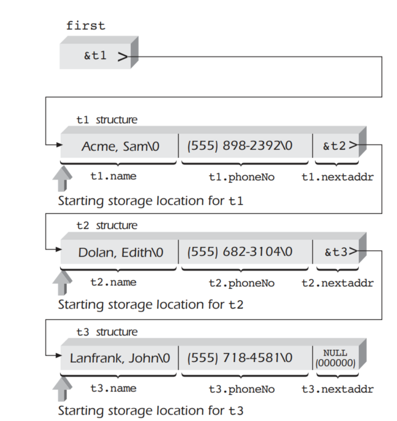

# Estructuras en C++ (Structs)

## A) Estructuras sencillas

### 1. Declaración

Declarar una estructura requiere enlistar los tipos de datos, los nombres de datos y el orden de los elementos de datos. 

Por ejemplo, la definición;

~~~cpp
struct {
    int dato1;
    int dato2;
} nombre_estructura;
~~~

lo anterior le da forma a una estructura llamada nombre_estrutura y reserva almacenamiento para los elementos de datos individuales enlistados en la estructura.

Se tienen acceso a cada miembro de una estructura dando tanto el nombre de la estructura como el nombre del elemento de datos individual, separado por un punto. Por tanto, **nombre_estrutura.dato1** se refiere al primer miembro de la estructura **nombre_estructura**

Como en la mayor parte de las instrucciones en C++, el espaciamiento en la definición de una estructura no es rígido. Por ejemplo, la estructura nacimiento podría haberse definido también como:

~~~cpp
struct { int dato1; int dato2; } nombre_estructura;
~~~ 

Además, como con todas las definiciones de instrucciones en C++, pueden definirse múltiples variables en la misma instrucción. Por ejemplo, la instrucción de definición:

~~~cpp
struct {
    int dato1;
    int dato2;
} nombre_estructura1, nombre_estructura2 ;
~~~

Lo anterior genera nombre_estructura1 y nombre_estructura2 de a forma struct { int dato1; int dato2; }.

Otra forma generar es crear la estructura y darle un nombre en específico, por ejemplo:

~~~cpp
struct Estructura_datos{
    int dato1;
    int dato2;
};
~~~

Esto define un tipo de datos nuevo que es una estructura de datos de la forma declarada. Por tanto se pueden generar nuevas struct's del tipo **Estructura_datos**, de la siguiente forma:

> Estructura_datos nuevo, nuevo2;

La inicialización de estructuras sigue las mismas reglas que para la inicialización de arreglos: las estructuras globales y locales pueden inicializarse al colocar después de la definición una lista de inicializadores. 

> Estructura_datos nuevo = {10, 25};

### 2. Tipos de datos en una estructura

En una estructura pueden ir cualquier tipo de datos e incluso otras estructuras.

~~~cpp
struct Estructura_fecha{
    char dia;
    int fecha[3];
}

struct Estructura_datos{
    int dato1;
    int dato2;
    Estructura_fecha fecha;
};
~~~

## B) Arreglos de estructuras 

El poder verdadero de las estructuras se comprende cuando la misma estructura se usa para listas de datos. 

| Employee Number | Employee Name | Employee Pay Rate |
|-----------------|---------------|-------------------|
| 32479           | Abrams, B.    | 6.72              |
| 33623           | Bohm, P.      | 7.54              |
| 34145           | Donaldson, S. | 5.56              |
| 35987           | Ernst, T.     | 5.43              |
| 36203           | Gwodz, K.     | 8.72              |
| 36417           | Hanson, H.    | 7.64              |
| 37634           | Monroe, G.    | 5.29              |

Por ejemplo, suponga que los datos mostrados en la tabla anterior deben ser procesados. Los números de empleado pueden almacenarse juntos en un arreglo de números enteros, los nombres en un arreglo de cadenas y las tarifas de pago en un arreglo de números de precisión doble. Al organizar los datos de esta forma, cada columna en la tabla se podría considerar como una lista separada, la cual es almacenada en su propio arreglo. La correspondencia entre elementos para cada empleado individual se mantiene almacenando los datos de un empleado en la misma posición en cada arreglo.

Declarar un arreglo de estructuras es lo mismo que declarar un arreglo de cualquier otro tipo de variable. Por ejemplo, si el tipo de datos Reg_pago es declarado como:

~~~cpp
struct Reg_pago {
    int num_id; 
    string nombre; 
    double tarifa;
};
~~~

Por tanto un arreglo de diez estructuras puede declararse como:

> Reg_pago empleado[10]; // arreglo empleado del tipo Reg_pago

Esta instrucción de definición construye un arreglo de diez elementos, cada uno de los cuales es una estructura del tipo de datos Reg_pago. Se observa que la creación de un arreglo de diez estructuras tiene la misma forma que la creación de cualquier otro arreglo, como por ejemplo:

> int empleado[10]; // arreglo empleado del tipo int

Una vez que se ha declarado un arreglo de estructuras, se referencia un elemento de datos particular dando la posición de la estructura deseada en el arreglo seguida por un punto y el miembro de la estructura apropiado. 

Por ejemplo, la variable **empleado[0].tarifa** hace referencia al miembro tarifa de la primera estructura empleado en el arreglo empleado. Incluir estructuras como elementos de un arreglo permite que se procese una lista de estructuras usando técnicas de programación de arreglos estándares.

## C) Estructuras como argumentos de una función

### 1. Transmisión por copia

~~~cpp
struct Empleado{
    int num_id;
    int tarifa_pago;
    int horas;
}

int main(){
    Reg_pago empleado;
    // inicializar las variables
    mostrar_emepleado(empleado.nombre);
    calcular_pago(empleado);
}
~~~

### 2. Transmisión por referencia

Pasar la estructura por referencia permite que la función llamada tenga acceso directo a la variable de estructura en la función que llama y altera su valores. 

> double calcNeto(Empleado &);

~~~cpp
int main(){
    // declaraciones
    // función
    calNet(emp);
}
~~~

### 3. Transmisión por apuntador

En lugar de transmitir una referencia, puede usarse un apuntador. Usar un apuntador requiere, además de modificar el prototipo de la función y la línea de encabezado, que la llamada a calcNeto() en el programa 13.4 se modifique a:

> double calcNet(Empleado *);
~~~cpp
int main(){
    // declaraciones
    // función
    calNet(&emp);
}
~~~

El apuntador pt recibe la dirección inicial de una estructura siempre que se llame a calcNeto(). Dentro de calcNeto(), este apuntador se usa para hacer referencia directa a cualquier miembro en la estructura. Por ejemplo 

- **`(*pt).num_id`** | **`pt->num_id`** se refiere al miembro num_id de la estructura 
- **`(*pt).tarifaPago`** | **`pt->tarifa_pago`** se refiere al miembro tarifaPago de la estructura 
- **`(*pt).horas`** | **`pt->horas`** se refiere al miembro horas de la estructura. 

### 4. Devolución de estructuras

En la práctica, la mayor parte de las funciones que manejan estructuras reciben acceso directo a una estructura al recibir una referencia o dirección a una estructura. Entonces pueden hacerse los cambios a la estructura en forma directa desde dentro de la función.

Por tanto el prototipo de la función debe declararse asi:

> Empleado nombre_funcion();

~~~cpp
Empleado nombre_funcion(){
    Empleado nuevo;
    nuevo.num_id = 1;
    nuevo.tarifa_pago = 20;
    nuevo.horas = 24;

    return nuevo;
}
~~~

## D) Listas vinculadas

Una lista vinculada es tan sólo un conjunto de estructuras en el que cada estructura **contiene al menos un miembro cuyo valor es la dirección de la siguiente estructura** ordenada lógicamente en la lista.

Considerar la siguiente lista de números telefónicos:

| Employee Name   | Employee Number |
|-----------------|-----------------|
Amador, Samuel    |(555) 898-2392
Domínguez, Edith  |(555) 682-3104
López, Juan       |(555) 718-4581
Martínez, Esteban |(555) 382-7070
Zapata, Horacio   |(555) 219-9912

Una lista vinculada proporciona un método conveniente para mantener una lista que cambia en forma constante, sin necesidad de reordenar y reestructurar de manera continua la lista completa. 

En C++ una estructura puede contener cualquier tipo de datos.
Por ejemplo, la declaración de estructura:

~~~cpp
struct test{
    int idNum;
    double *ptPay;
}
~~~

~~~cpp
#include <iostream>
#include <string>
using namespace std;

struct TeleType{
    string name;
    string phoneNo;
    // es un apuntador adecuado para almacenar la dirección de una estructura del tipo TeleType.
    TeleType *nextaddr;
};

int main(){
    TeleType t1 = {"Acme, Sam","(555) 898-2392"};
    TeleType t2 = {"Dolan, Edith","(555) 682-3104"};
    TeleType t3 = {"Lanfrank, John","(555) 718-4581"};
    TeleType *first; // create a pointer to a structure

    first = &t1; // store t1's address in first
    t1.nextaddr = &t2; // store t2's address in t1.nextaddr
    t2.nextaddr = &t3; // store t3's address in t2.nextaddr
    t3.nextaddr = NULL; // store a NULL address in t3.nextaddr

    cout << endl << first->name
    << endl << t1.nextaddr->name
    << endl << t2.nextaddr->name
    << endl;
}
~~~

La expresión **first = &t1** almacena la dirección de la primera estructura en la lista en la variable apuntadora llamada first. La expresión **t1.nextaddr= &t2** almacena la dirección inicial de la estructura t2 en el miembro apuntador de la estructura t1. Del mismo modo, la expresión **t2.nextaddr = &t3** almacena la dirección inicial de la estructura t3 en el miembro apuntador de la estructura t2. Para terminar la lista, el valor del apuntador NULL, el cual es cero, se almacena en el miembro apuntador de la estructura t3.

## E) Asignación dinámica de estructuras de datos

Esta asignación dinámica de memoria es útil en especial cuando se aborda una lista de estructuras debido a que permite expandir la lista conforme se agregan nuevos registros y contraerla conforme se eliminan registros.

Al asignar almacenamiento en forma dinámica, no se tiene indicación anticipada del lugar en que el sistema de cómputo reservará físicamente el número de bytes solicitado. Para proporcionar acceso a estas ubicaciones, **new devuelve la dirección de la primera ubicación que se ha reservado**. Esta dirección debe ser asignada, por supuesto, a un apuntador.

La devolución de un apuntador por new es útil en especial para crear una lista vinculada de estructuras de datos. Conforme se crea cada estructura nueva, el apuntador devuelto por new a la estructura puede asignarse a un miembro de la estructura previa en la lista.

Usando ejemplo la estrucutra TeleType, se le asignará memoria dinámica de la siguiente forma:

> TeleType *recPoint = new TeleType;

### 1. Lista vinculada usando "new"

Las estructuras usadas en una lista vinculada deben contener al menos un miembro apuntador. La dirección en el miembro apuntador es la dirección inicial de la siguiente estructura en la lista. **Debe reservarse un apuntador para la dirección de la primera estructura, y al miembro apuntador de la última estructura en la lista se le da una dirección NULL** para indicar que no se apunta a más miembros.

~~~cpp
const int MAXRECS = 3; // maximum no. of records

struct TeleType {
    char name;
    char phoneNo;
    TeleType *nextaddr;
};

void populate(TeleType *); // function prototype needed by main(
void display(TeleType *); // function prototype needed by main(

int main() {
    int i;
    TeleType *list, *current; // two pointers to structures of
    // type TeleType
    // get a pointer to the first structure in the list
    list = new TeleType;
    current = list;
    // populate the current structure and create the remaining str

    for(i = 0; i < MAXRECS - 1; i++){
        populate(current);
        current->nextaddr = new TeleType;
        current = current->nextaddr;
    }

    populate(current); // populate the last structure
    current->nextaddr = NULL; // set the last address to a NULL add
    cout << "\nThe list consists of the following records:\n";
    display(list); // display the structures
    return 0;
}
~~~

La primera vez que se llama a new en el programa anterior se usa para crear la primera estructura en la lista vinculada. Como tal, la dirección devuelta por new se almacena en la variable apuntadora llamada lista. La dirección en lista se asigna luego al apuntador llamado actual. Esta variable apuntadora siempre es usada por el programa para apuntar a la estructura actual. Debido a que la estructura actual es la primera estructura creada,
la dirección en el apuntador llamado lista es asignada al apuntador llamado actual.

Dentro del ciclo for de main(), los miembros nombre y número telefónico de la estructura recién creada son poblados llamando a poblar() y transmitiendo la dirección de la estructura actual a la función. Con la devolución de poblar(), se asigna una dirección al miembro apuntador de la estructura actual. Esta dirección es la dirección de la siguiente estructura en la lista, la cual se obtiene de new. La llamada a new crea la siguiente estructura y devuelve su dirección al miembro apuntador de la estructura actual. Esto completa la población del miembro actual. La instrucción final en el ciclo for reinicia la dirección en el apuntador actual con la dirección de la siguiente estructura en la lista.

## F) Uniones 

Una unión es un tipo de datos que reserva la misma área en la memoria para dos o más variables, cada una de las cuales puede ser un tipo de datos diferente. Una variable que se declara como un tipo de datos de unión puede usarse para contener una variable de carácter, una variable en número entero, una variable de precisión doble o cualquier otro tipo de datos válido en C++. **Cada uno de estos tipos, pero sólo uno a la vez, puede asignarse en realidad a la variable unión.**

~~~cpp
union{ 
    char clave; 
    int num; 
    double voltios;
} val;
~~~