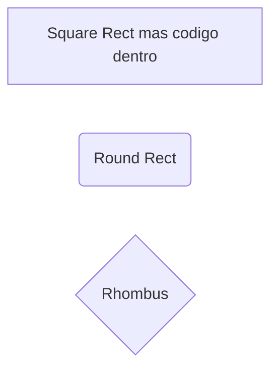

# Enunciados de ejercicios
## 1 d
ssssss
### 1.1 d  
ssss
#### 1.2 d
ssss
numero 1, prueba md git

##### 1.3 fff
fffff

**ddd**
**ddd**
>**ddd**
\textcolor{red}{el\_texto}
>
xx

$$
centrar contenido
$$

[cuadrado]
(redondo)
"fff 

And this will produce a flow chart:
