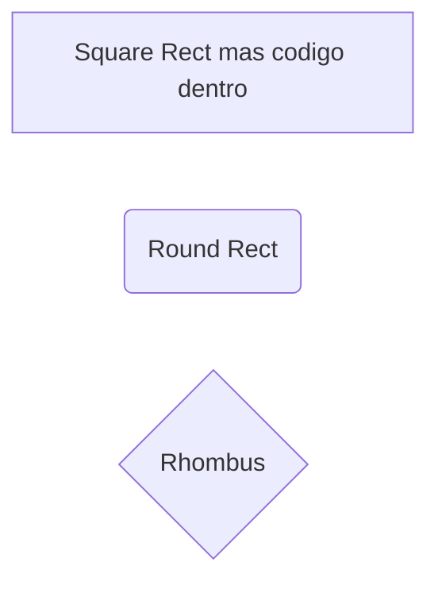

# Enunciados de ejercicios
## d
numero 1, prueba md git

**ddd**
>**ddd**
\textcolor{red}{el\_texto}
>
xx

$$
centrar contenido
$$

[cuadrado]
(redondo)

And this will produce a flow chart:

```mermaid
graph LR

A[Square Rect mas codigo dentro ]
C(Round Rect)
D{Rhombus}

```